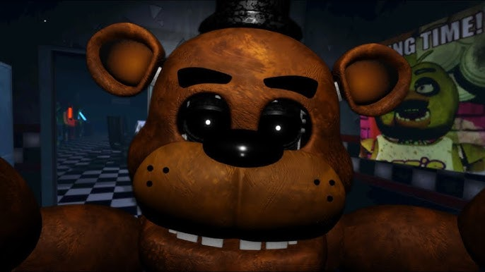
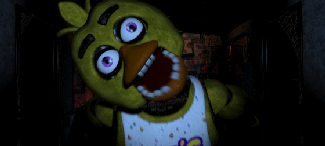
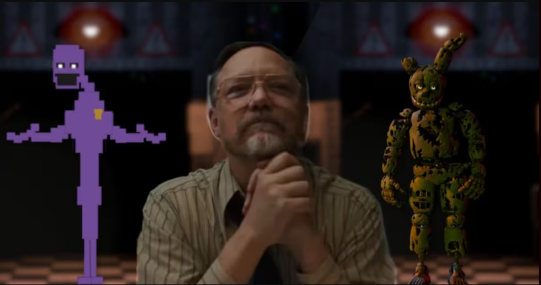
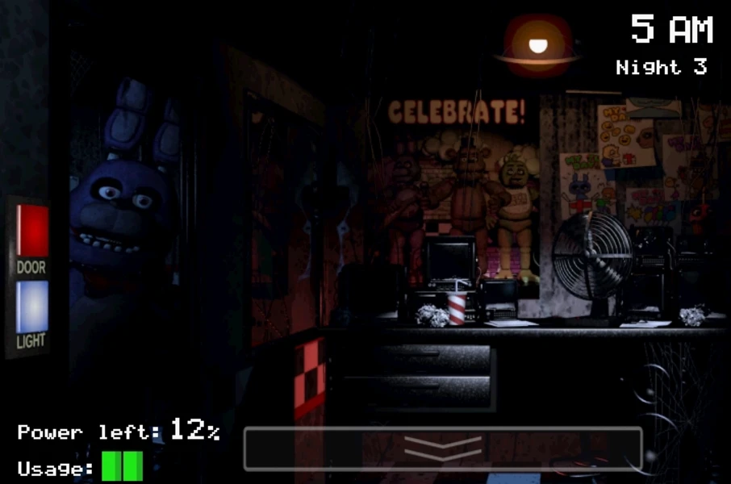

# **Historia de Five Nights at Freddy's (FNAF)**

## **Introducción**
*Five Nights at Freddy's* (FNAF) es una franquicia de videojuegos de terror creada por **Scott Cawthon**. La historia gira en torno a **Freddy Fazbear's Pizza**, un restaurante inspirado en locales reales como Chuck E. Cheese, que esconde oscuros secretos relacionados con asesinatos, animatrónicos poseídos y un complejo trasfondo que se revela a lo largo de varios juegos.

## **Capítulos principales de la saga**

### **1. Freddy Fazbear's Pizza**
- **El restaurante:** Un lugar aparentemente inocente donde las familias disfrutan de comida y entretenimiento proporcionado por animatrónicos.

- **El incidente:** Comienzan a suceder desapariciones y asesinatos de niños, que llevan al cierre temporal del restaurante.

### **2. Los animatrónicos poseídos**
- Cada animatrónico está poseído por el espíritu de un niño asesinado.
- Los principales animatrónicos son:
  - **Freddy Fazbear**: El líder del grupo.
  
  - **Bonnie**: Guitarrista animatrónico.
  
  - **Chica**: La animatrónica encargada de la comida.
  
  - **Foxy**: El pirata rebelde.
  

### **3. William Afton y los asesinatos**
- **William Afton**, también conocido como *The Purple Guy*, es el principal antagonista de la serie.
- Es el responsable de los asesinatos en Freddy Fazbear's Pizza.
- Sus acciones llevan a la creación de los animatrónicos vengativos.

## **Cronología de los juegos**

### **1. FNAF 1 (2014)**
- **Rol:** El jugador es un guardia nocturno que debe sobrevivir cinco noches vigilando las cámaras de seguridad mientras los animatrónicos intentan atacarlo.
- **Historia:** Se revelan los primeros indicios de los niños desaparecidos y los secretos detrás de los animatrónicos.

### **2. FNAF 2**
- **Precuela:** Se desarrolla antes de los eventos del primer juego.
- **Nueva mecánica:** Introduce la máscara para engañar a los animatrónicos.
- **Personajes adicionales:** Nuevos animatrónicos como *The Puppet* y *Balloon Boy*.

### **3. FNAF 3**
- **Ambientación:** Una atracción de terror llamada *Fazbear's Fright*.
- **Antagonista principal:** *Springtrap*, un animatrónico en el que está atrapado William Afton.

### **4. FNAF 4**
- **Perspectiva:** Explora las pesadillas de un niño pequeño.
- **Terror psicológico:** Los animatrónicos aparecen en forma de pesadillas grotescas.

### **5. Sister Location**
- **Historia:** Se centra en *Circus Baby's Entertainment and Rental*, otro local creado por Afton.
- **Personajes:** Introduce nuevos animatrónicos como *Circus Baby* y *Funtime Freddy*.

## **Temas recurrentes**

### **1. Muerte y venganza**
- Los animatrónicos buscan venganza por las atrocidades cometidas por Afton.

### **2. Familias rotas**
- La serie explora el impacto de los crímenes en las familias, incluida la de William Afton.

### **3. Misterio y secretos**
- Muchos elementos de la historia están ocultos en minijuegos y mensajes encriptados.

## **Personajes clave**

| Nombre            | Rol                                   | Descripción                              |
|-------------------|---------------------------------------|------------------------------------------|
| William Afton     | Antagonista principal                | Asesino en serie y creador de animatrónicos. |
| Michael Afton     | Hijo de William                      | Protagonista en varios juegos.           |
| The Puppet        | Espíritu vengativo                   | Ayuda a los niños asesinados.            |
| Circus Baby       | Animatrónico principal de Sister Location | Diseñado para atraer y capturar niños.   |

## **Curiosidades**
- FNAF comenzó como un juego independiente pero rápidamente se convirtió en un fenómeno cultural.
- La serie incluye libros, teorías fanáticas y una próxima película.

## **Referencias**
1. Sitio oficial de *Five Nights at Freddy's*.
2. Teorías publicadas por la comunidad de *The Game Theorists*.
3. Libros oficiales como *The Silver Eyes*.

## **Créditos**
- **Creador:** Scott Cawthon
- **Fans:** La comunidad de FNAF ha jugado un papel importante en mantener viva la franquicia.

_Disfruta explorando el oscuro y fascinante mundo de *Five Nights at Freddy's*!_

