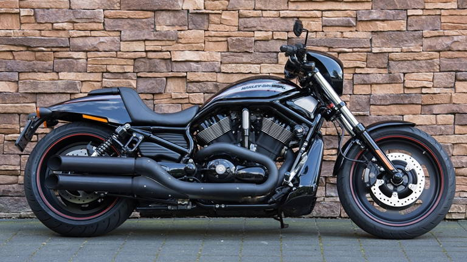
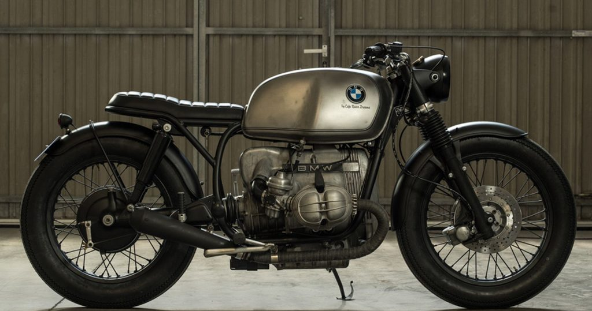
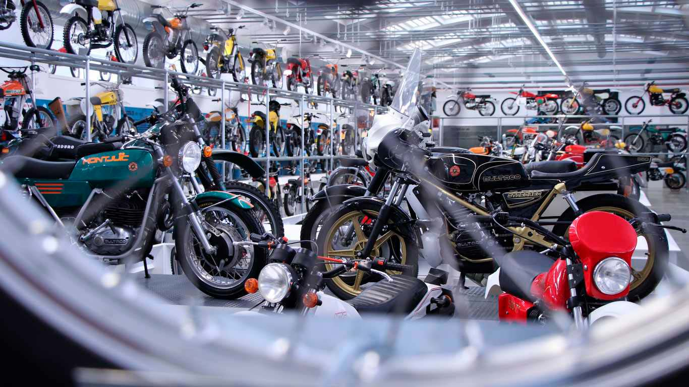

# Motos Clásicas 🏍️
## Post creado por Laura
Las motos clásicas son más que vehículos; son piezas de historia y arte que representan épocas pasadas del motociclismo. Con su diseño vintage y mecánica simple, estas máquinas continúan capturando la imaginación de los entusiastas de todo el mundo.

---

## ¿Qué define a una moto clásica?  
Una moto clásica generalmente tiene las siguientes características:  
- **Edad**: Normalmente, se considera clásica si tiene más de 25 años.  
- **Diseño icónico**: Su estética marcó una época o un estilo.  
- **Valor histórico**: Son modelos que dejaron huella en la industria del motociclismo.  

---

## Marcas icónicas de motos clásicas

### 1. **Harley-Davidson**
- **Modelos clásicos**: 
  - Knucklehead (1936)
  - Panhead (1948)
  - Shovelhead (1966)
- **Características**: Motor en V, sonido inconfundible y un legado americano.  
 

### 2. **Triumph**
- **Modelos clásicos**: 
  - Bonneville T120 (1959)
  - Tiger Cub (1956)
  - Trident T150 (1968)
- **Características**: Motores británicos de alto rendimiento y diseño refinado.  
 

### 3. **Royal Enfield**
- **Modelos clásicos**: 
  - Bullet 350 (1948)
  - Interceptor 650 (1960)
- **Características**: Simplicidad mecánica y durabilidad, perfecta para rutas largas.  

 

### 4. **BMW**
- **Modelos clásicos**: 
  - R32 (1923)
  - R90S (1973)
- **Características**: Motores bóxer y excelencia en ingeniería alemana.  
 
---

## Razones para amar las motos clásicas ❤️
1. **Estilo único**: Cada moto cuenta una historia y tiene un diseño atemporal.  
2. **Mecánica sencilla**: Perfecta para quienes disfrutan del mantenimiento y la restauración.  
3. **Cultura y comunidad**: Los propietarios de motos clásicas forman una red global de apasionados.  
4. **Inversión**: Muchas motos clásicas aumentan de valor con el tiempo.  
5. 
 
---

## Cuidado y mantenimiento
Mantener una moto clásica en buen estado requiere:  
- **Revisión periódica**: Inspeccionar partes como el motor, frenos y neumáticos.  
- **Lubricación regular**: Aceites específicos para motores antiguos.  
- **Restauración**: Usar piezas originales o réplicas de alta calidad.  

---

## Eventos y exposiciones
Los amantes de las motos clásicas suelen reunirse en:  
- **Clásicas en ruta**: Concentraciones de motos clásicas para recorrer rutas pintorescas.  
- **Exposiciones internacionales**: Como el **Classic Motorcycle Show** en Birmingham, Reino Unido.  
- **Subastas**: Casas como Bonhams subastan modelos únicos.  

---

## Conclusión  
Las motos clásicas son un homenaje al pasado y una inspiración para el futuro. Conducir una de estas máquinas es más que un viaje, es una experiencia llena de historia, estilo y pasión.